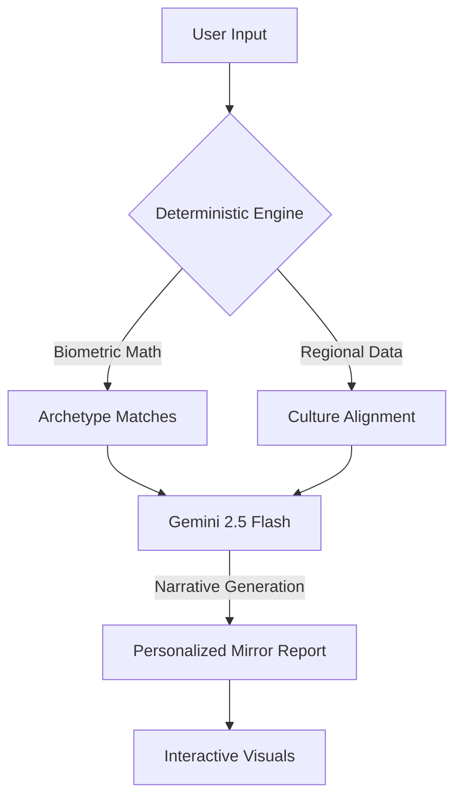

# 🏅 Team USA Digital Mirror

<p align="center">
  
  
  
</p>

> **"Step into the M.I.R.R.O.R. Where your biometrics meet 120 years of Team USA history."**

The **Team USA Digital Mirror** is an immersive exploration platform that bridges the gap between historical sports data and personal potential. Using **Gemini 2.5 Flash**, it transforms your physical profile into a narrative journey across Olympic and Paralympic history.

**Live app:** https://team-usa-digital-mirro-276673677122.us-central1.run.app/

---

## 🌟 The Experience

Unlike standard fitness apps, the Digital Mirror doesn't just track metrics — **it reflects your athletic archetype.**

- 🧬 **Historical Synchronization**: Match your profile against the actual distributions of Team USA athletes from the last century.
- ⏳ **Chronological Journey**: See which era of Olympics/Paralympics (from the 1900s to today) aligns best with your physiology.
- 🌎 **Regional Heritage**: Explore how your hometown's sport culture influences the national pipeline.
- ♿ **Inclusive Pathways**: Deep-dive into Paralympic classifications with the same analytical rigor as Olympic datasets.

---

## ✨ Key Features

### 🤖 Generative Narrative Engine
Powered by **Gemini**, the app analyzes deterministic matches and weaves them into a "Mirror Narrative" — a personalized story that explains *why* you align with certain sport families.

### 🔍 Explainable Archetypes
No black-box recommendations. The platform uses a hybrid **Deterministic + GenAI** approach:
1. **The Core**: Precise mathematical matching for height, weight, and BMI.
2. **The Layer**: AI-driven context that adds nuance for goals, regions, and interests.

### ♿ Accessibility-First Architecture
Designed for the full spectrum of fans:
- **Reduced Motion Mode** for sensitive users.
- **High Contrast Support** for visual clarity.
- **Keyboard-Optimized Navigation**.

---

## ⚙️ How It Works



1. **Scan**: Input your biometrics and interests.
2. **Analyze**: The backend processes CSV-grounded historical data.
3. **Reflect**: Gemini generates an inspiring, conditional narrative.
4. **Explore**: Engage with Radar Charts, Era Breakdowns, and Sport Science context.

---

## 🛠️ Tech Stack

| Layer | Technology |
| :--- | :--- |
| **Frontend** | React 18, Vite, Tailwind CSS, Framer Motion |
| **Backend** | Node.js, Express |
| **AI** | Vertex AI / Gemini 2.5 Flash |
| **Visualization** | Recharts, D3.js |
| **Data** | CSV-grounded Historical Archetypes |

---

## 🚀 Deployment & Architecture

The application is built for the **Google Cloud** ecosystem:
- **Compute**: Cloud Run
- **AI Infrastructure**: Vertex AI / Gemini API

### Cloud Run environment

For Cloud Run, the recommended hosted setup is Vertex AI project authentication. This uses the Cloud Run service account instead of a browser-visible API key:

```bash
gcloud run services update SERVICE_NAME \
  --project ardent-fusion-496018-s8 \
  --region us-central1 \
  --update-env-vars GOOGLE_CLOUD_PROJECT=ardent-fusion-496018-s8,VERTEX_AI_LOCATION=us-central1,GEMINI_MODEL=gemini-2.5-flash,AI_PROVIDER=vertex
```

Make sure the Cloud Run service account has permission to call Vertex AI. AI Studio previews may inject `GEMINI_API_KEY` automatically, but Cloud Run services do not inherit that key after deployment.

```text
/src
 ├── /lib
 │    └── matcher.ts    # Deterministic biometric logic
 ├── /components
 │    └── GeminiChat.tsx # Real-time interactive analyst
 └── App.tsx            # Immersive UI Hub
/server.ts             # Express API & Grounding Data provider
```

---

## 🛡️ Responsible AI Statement

**Team USA Digital Mirror is an exploratory educational tool.**
It is designed to celebrate the history of Team USA and promote scientific exploration of sport archetypes.

- ❌ **Not a predictor** of athletic success.
- ❌ **Not medical advice** or formal classification.
- ❌ **No guaranteed outcomes.**

---

## 🔮 Future Roadmap

- [ ] **Real-time Pose Mirroring**: Using MediaPipe for movement-based matching.
- [ ] **Multi-language Support**: Bringing the history of Team USA to a global audience.
- [ ] **Wearable Integration**: Connecting to health devices for dynamic mirror updates.

---

<p align="center">
  Built with ❤️ by <b>Gemini + Google Cloud</b>
</p>
